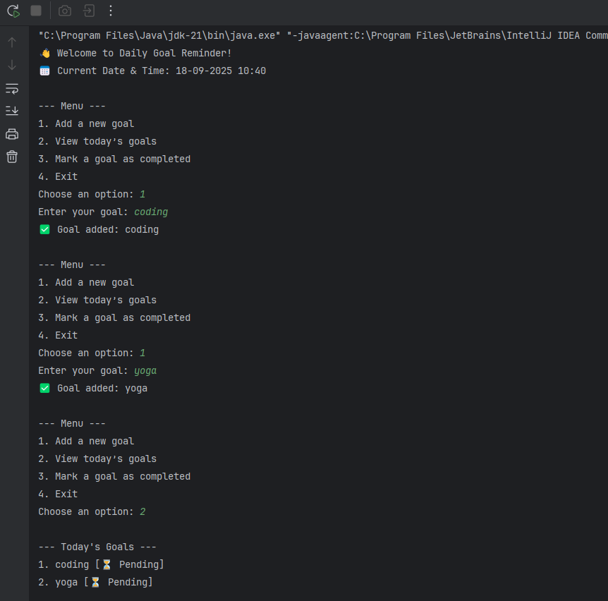
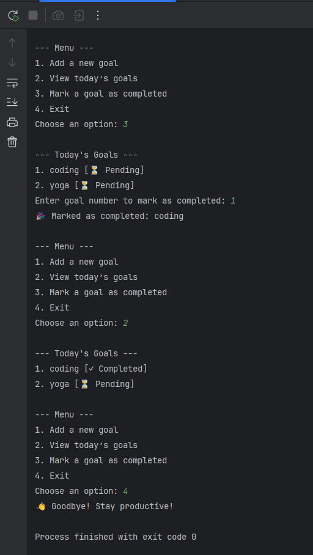

# Daily Goal Reminder ✅⏳

A simple Java console application that allows users to set, view, and manage their daily goals.  
This project was created as part of my MotionCut Internship (Week 2 Project).  

---

## 🚀 Features
- Add multiple goals in one session  
- View today's goals clearly  
- Mark goals as completed (✓)  
- Simple **menu-driven system**  
- Shows current **date & time** at startup  
- Handles invalid input safely  

---

## 🖥️ Example Run
```
👋 Welcome to Daily Goal Reminder!
📅 Current Date & Time: 18-09-2025 09:45

--- Menu ---
1. Add a new goal
2. View today’s goals
3. Mark a goal as completed
4. Exit
Choose an option: 1

Enter your goal: Finish MotionCut project
✅ Goal added: Finish MotionCut project
```

---

## 📸 Screenshot
Here’s a screenshot of the console output demo:  

  



---

## ⚙️ How to Run
1. Clone this repository:
   ```bash
   git clone https://github.com/your-username/DailyGoalReminder.git
   ```
2. Open the project in **IntelliJ IDEA** (or any Java IDE).  
3. Navigate to the `src/` folder.  
4. Compile and run:
   ```bash
   javac DailyGoalReminder.java
   java DailyGoalReminder
   ```

---

## 📚 Concepts Used
- Java **Scanner** class for input  
- **ArrayList** for storing goals  
- **Switch-case** for menu handling  
- **DateTimeFormatter** for date & time  
- Loops (`while`, `for`)  
- Methods for modular code  

---

## ✨ Author
👤 **Sandip Pal**  
- GitHub: [sandip-pal1](https://github.com/sandip-pal1)  
- LinkedIn: [Sandip Pal](https://www.linkedin.com/in/sandip-pal-7877b9285/)  

---
